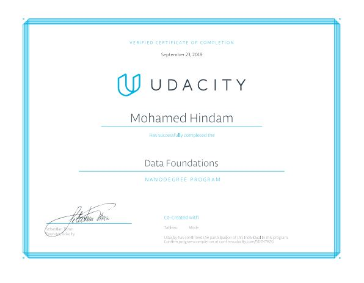

## Udaicity

### Data Foundations Nanodegree 


[confirm here](https://graduation.udacity.com/confirm/SDZK7KZG)

***

### Data Analyst for Enterprise Nanodegree 


[confirm here](https://graduation.udacity.com/confirm/FJ5KMEME)

***

### deep learning  is fun
```{r, echo=FALSE}
# Define variable containing url
url3 <- "https://selfdrivingcars.mit.edu/files/deeptraffic/visualization_media/25740.gif"
```
#### MIT Deeptraffic Competiton:
<br><b>


***